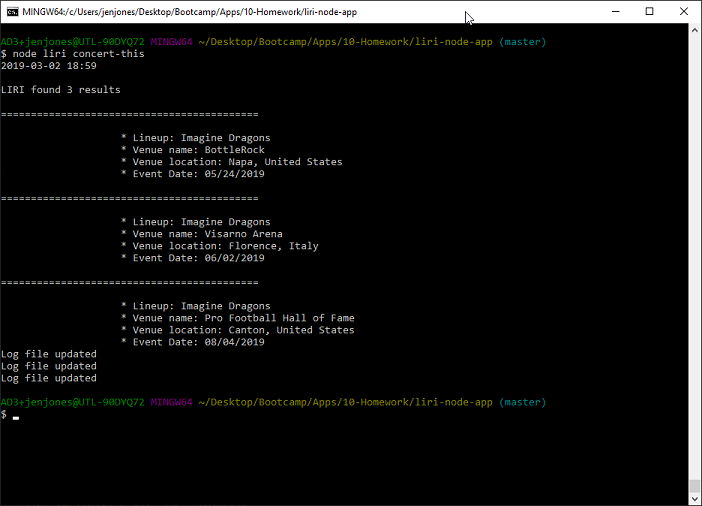

# liri-node-app

## Description
LIRI is a Language Interpretation and Recognition Interface. This is a command line node app that takes in arguments entered by the user and returns data.
___
## User Setup

1. Clone LIRI App

2. Obtain Keys for the following APIs & add to your .env file
    * BandCamp
    * OMBD
    * Spotify

3. Run NPM Install for the following dependencies
    * Axios
    * Dotenv
    * Moment.js
    * Spotify
___
## User Interface
Navigate to where LIRI app is saved, then enter `node liri` + one of the following:

1. `concert-this` + `<artist/band name here>` displays:
    * Venue name
    * Venue location
    * Event date

    * NOTE: If no artist/band name is entered, LIRI pulls data for Imagine Dragons

2. `spotify-this-song` + `<song name here>` displays:
    * Artist name
    * Song name
    * Album name
    * Song preview URL from Spotify
    * NOTE:  If no song name is entered, LIRI defaults to "The Sign"

3. `movie-this` + `<movie name here>` displays:
    * Title
    * Year
    * IMDB Rating
    * Rotten Tomatoes Rating
    * Country where the movie was produced
    * Language
    * Plot
    * Actors
    * NOTE:  If no movie name is entered, LIRI defaults to "Mr. Nobody"

4. `do-what-it-says` 
    * Uses the fs Node package to take the text inside the random.txt file to call the spotify-this-song command using "I Want it that Way"

NOTE: 
* Command results are logged to `log.txt` file.
* No command results in a prompt:
* Unrecognized command results in a prompt:
___
## Technology
* API - OMDB (via NPM Axios)
* API - Bands in Town (via NPM Axios)
* Node.js
* NPM Dotenv
* NPM Spotify
* JavaScript
* Moment.js
